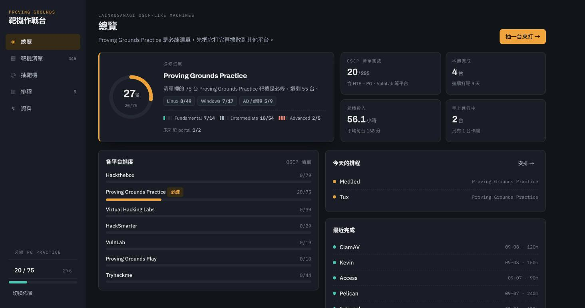
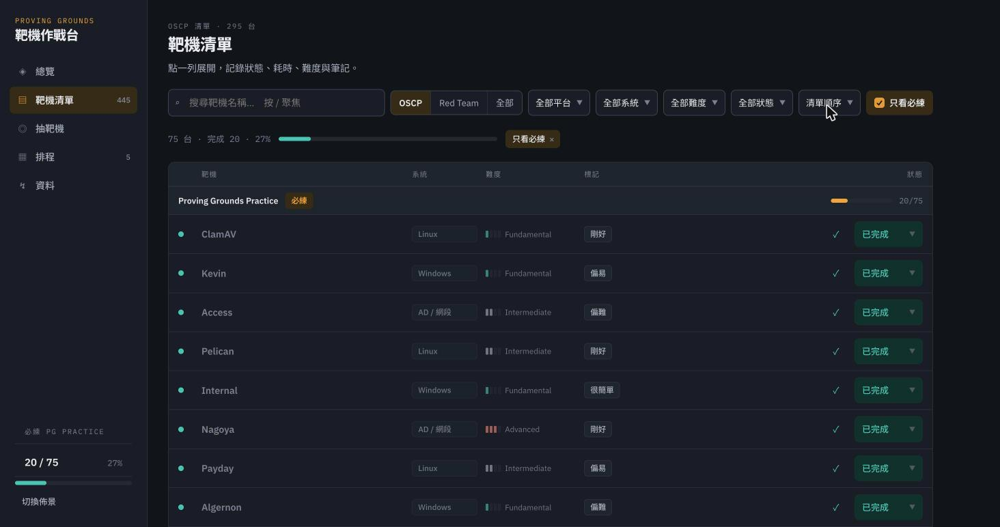

# OSCP 靶機作戰台

離線可用的 OSCP 靶機練習追蹤器：記錄打過哪些靶機、隨機抽一台來打、安排每週排程。
靶機清單整理自 [LainKusanagi 的 OSCP-like machines 清單](https://docs.google.com/spreadsheets/d/18weuz_Eeynr6sXFQ87Cd5F0slOj9Z6rt/)（445 台），難度取自 OffSec portal。

> An offline-first tracker for the LainKusanagi OSCP-like machine list — log what you've
> pwned, draw a random box, plan your week. One HTML file, no server, no build step,
> no dependencies, no account.



## 怎麼跑起來

### 最快：一個檔案

下載 [`dist/oscp-tracker.html`](dist/oscp-tracker.html)，用瀏覽器打開。沒了。

沒有安裝步驟、沒有伺服器、沒有帳號。所有東西（含 445 台靶機資料）都在那一個檔案裡。

### 或者 clone 下來改

```bash
git clone <你的 repo 網址> && cd OPSC_track
open web/index.html          # macOS
xdg-open web/index.html      # Linux
start web\index.html         # Windows
```

`web/` 底下就是網站本體，改完存檔重新整理就看得到。如果你的瀏覽器擋掉本機檔案之間的載入，改用下面的方式。

### 想在手機或其他裝置上開

```bash
python3 -m http.server 8731 --directory web
```

同網段的裝置連 `http://<這台電腦的 IP>:8731` 就行。要放到網路上的話，這是純靜態網站，
丟進 GitHub Pages、Netlify、Cloudflare Pages 或任何靜態空間都可以，`dist/oscp-tracker.html`
單檔上傳也行。

## 這東西吃多少資源

沒有後端、沒有資料庫、沒有建置流程、沒有 npm。整包就是三個靜態檔加一份 128 KB 的靶機資料，
除了瀏覽器分頁本身以外不佔用任何東西。唯一的外部請求是 Google Fonts 的字型檔；
離線開一樣能用，只是字型換成系統字型。

進度存在瀏覽器的 localStorage，沒有任何資料離開你的電腦。

## 功能

- **總覽** — Proving Grounds Practice 必修完成度、各平台進度、本週完成數與連續打靶天數、今日排程
- **靶機清單** — 445 台依平台分組，可用平台／系統／難度／狀態篩選與搜尋；每台可記錄耗時、難度自評、writeup 連結與筆記
- **抽靶機** — 從候選池隨機抽一台，預設鎖定還沒打完的必練 PG 機器，可再限定系統與難度
- **排程** — 週視圖，手動排入或一鍵自動排本週 5 台
- **資料** — 匯出／匯入 JSON 備份，換裝置或清快取前記得備份



## 資料從哪來

| 檔案 | 內容 |
| --- | --- |
| `data/lainkusanagi.xlsx` | 原始試算表（Google Sheets 匯出） |
| `data/offsec_labs.tsv` | OffSec portal 的 343 筆 Practice 靶機難度（名稱／等級／OS／類型／ID） |
| `data/machines.json` | 解析合併後的 445 台靶機 |
| `web/data.js` | 同上，包成瀏覽器直接載入的形式 |

難度等級 100/200/300/400 對應 Fundamental / Intermediate / Advanced / Insane，
**只套用在 Proving Grounds 平台**——HackTheBox 也有 Access、Escape、Heist 這類同名靶機，跨平台對名會配錯。

Proving Grounds Practice 必練 75 台的難度分布：Fundamental 14、Intermediate 54、Advanced 5；
另有 Hokkaido 與 Mice 兩台在 portal 上已查無資料，推測已下架。

## 重新產生資料

只有要更新靶機清單時才需要 Python，平常用不到。

```bash
uv run --with openpyxl python scripts/parse_sheet.py   # xlsx + tsv → data/machines.json、web/data.js
uv run python scripts/build.py                          # web/ → dist/ 單檔版
```

`data/offsec_labs.tsv` 是從 OffSec portal 的搜尋 API 取得的，格式為 `名稱\t等級\tOS\t類型\tID`，
手動維護或重新抓取都可以，`parse_sheet.py` 會自動併入。

## 專案結構

```
web/            網站本體（vanilla JS，無框架、無建置流程）
  index.html
  styles.css
  app.js
  data.js       產生物，已 commit，這樣不用跑 Python 就能直接用
dist/           單檔版（產生物）
data/           原始與解析後的資料
scripts/        資料解析與打包腳本
docs/           README 用的截圖
```

## 授權

程式碼採 [MIT](LICENSE)。

靶機清單由 LainKusanagi 整理並公開分享，難度分級是 OffSec 的產品資訊，
兩者著作權皆屬原作者所有；本專案只是把它們整理成方便練習追蹤的形式。
清單原始出處與作者的其他資源請見試算表本身。
