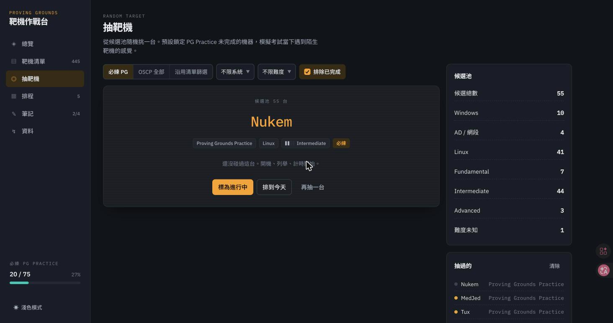
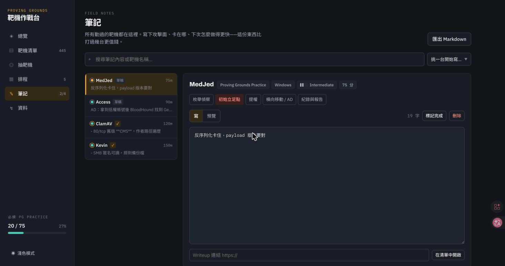
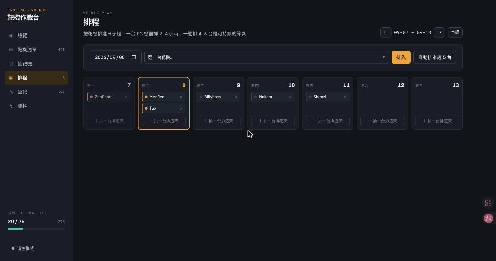
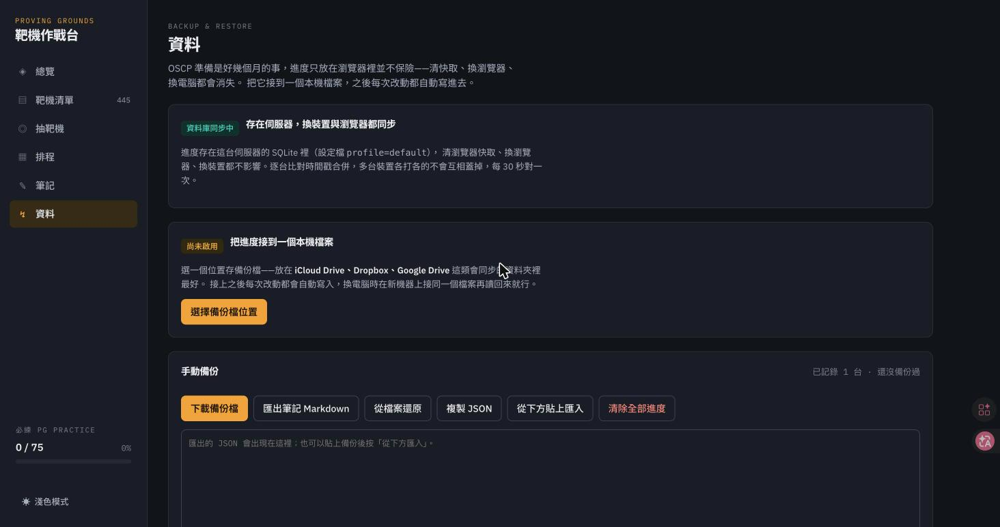

# OSCP 靶機作戰台

離線可用的 OSCP 靶機練習追蹤器：記錄打過哪些靶機、隨機抽一台來打、安排每週排程。
靶機清單整理自 [LainKusanagi 的 OSCP-like machines 清單](https://docs.google.com/spreadsheets/d/18weuz_Eeynr6sXFQ87Cd5F0slOj9Z6rt/)（445 台），難度取自 OffSec portal。

> An offline-first tracker for the LainKusanagi OSCP-like machine list — log what you've
> pwned, draw a random box, plan your week. One HTML file, no server, no build step,
> no dependencies, no account.


## 畫面

| | |
| --- | --- |
|  |  |
| **靶機清單**：依平台分組、可篩選，每台帶 OffSec 難度 | **抽靶機**：從候選池隨機挑一台，預設鎖定未完成的必練 |
|  |  |
| **筆記**：集中管理、支援 Markdown、草稿／完成狀態 | **排程**：週視圖，手動排入或一鍵自動排 |

## 怎麼跑起來

四種方式，由簡到繁。都不需要帳號，進度只存在你自己的裝置。

### 方式一：一個檔案（最快）

下載 [`dist/oscp-tracker.html`](dist/oscp-tracker.html)，用瀏覽器打開。沒了。

沒有安裝步驟、沒有伺服器、沒有帳號。所有東西（含 445 台靶機資料）都在那一個檔案裡。

### 方式二：Docker（推薦長期自架）

適合放在家用伺服器、NAS 或 VPS 上，開機自動啟動、隨時能連。有兩種，看你要不要伺服器端資料庫：

**（a）純靜態，最輕便** — 進度存在瀏覽器（同單檔版）：

```bash
git clone https://github.com/mlgzackfly/oscp-tracker.git && cd oscp-tracker
docker compose up -d          # nginx alpine，只提供 web/，約 10 MB 記憶體
```

**（b）帶資料庫，換裝置換瀏覽器都同步** — 進度存進伺服器端 SQLite：

```bash
docker compose -f docker-compose.db.yml up -d
```

打開 `http://localhost:8731`（或伺服器 IP）。(b) 的映像檔是 Python alpine + 標準庫的 `http.server` 與 `sqlite3`，
**零 pip 依賴**，一樣輕；資料庫是掛在 volume `oscp-data` 的一個 SQLite 檔，容器砍掉重建資料都還在。
前端會自動偵測到後端 API 並改用伺服器同步——不需要任何設定，「資料」分頁會顯示「資料庫同步中」。



多人共用一台：加 `?profile=你的名字` 就是各自獨立的一份進度（例如 `http://伺服器:8731/?profile=alice`）。
要放到公開網路，在 `docker-compose.db.yml` 設 `OSCP_TOKEN`，前端用 `?token=...` 帶入；否則只在信任的內網跑。

沒裝 compose 也能直接用 docker：

```bash
# 純靜態
docker build -t oscp-tracker . && docker run -d -p 8731:80 --restart unless-stopped oscp-tracker
# 帶資料庫
docker build -f Dockerfile.db -t oscp-tracker-db .
docker run -d -p 8731:80 -v oscp-data:/data --restart unless-stopped oscp-tracker-db
```

想換連接埠改 `-p 你要的埠:80`。停掉用 `docker compose down`（加 `-f docker-compose.db.yml` 對應 DB 版）。

### 方式三：本機開發／改東西

```bash
git clone https://github.com/mlgzackfly/oscp-tracker.git && cd oscp-tracker
open web/index.html          # macOS
xdg-open web/index.html      # Linux
start web\index.html         # Windows
```

`web/` 底下就是網站本體，改完存檔重新整理就看得到。如果你的瀏覽器擋掉本機檔案之間的載入，用方式四。

### 方式四：臨時起一個伺服器（手機／其他裝置也能連）

```bash
python3 -m http.server 8731 --directory web
```

同網段的裝置連 `http://<這台電腦的 IP>:8731` 就行。

> **放到公開網路？** 這是純靜態網站，丟進 GitHub Pages、Netlify、Cloudflare Pages 或任何靜態空間都可以，
> `dist/oscp-tracker.html` 單檔上傳也行。但進度存在瀏覽器本機，公開部署不會幫多人分開存——它就是給你自己用的一份。

## 這東西吃多少資源

沒有後端、沒有資料庫、沒有建置流程、沒有 npm。整包就是三個靜態檔加一份 128 KB 的靶機資料，
除了瀏覽器分頁本身以外不佔用任何東西。Docker 版也只是一個 nginx alpine 提供這些靜態檔，約 10 MB 記憶體。
唯一的外部請求是 Google Fonts 的字型檔；離線開一樣能用，只是字型換成系統字型。

## 進度存在哪、怎麼不弄丟

老實說：**只靠瀏覽器預設的 localStorage 並不夠。** 它沒有任何資料離開你的電腦，但也因此脆弱。
OSCP 準備動輒三個月，這期間 localStorage 有幾個真的會清空的情況，先講清楚：

- 「清除瀏覽資料／快取」會一起清掉它
- **換連接埠或換開啟方式就換了一個儲存空間**——`file://` 直接開、`http://localhost:8731`、
  Docker 換到別的埠，在瀏覽器眼中是不同來源（origin），各自獨立的 localStorage、彼此看不到對方的進度。
  自架時**固定用同一個網址進**，是最容易忽略卻最常見的遺失原因
- **Safari** 會清掉超過 7 天沒開的網站儲存（ITP 機制）——三個月裡放一週假就可能歸零
- 無痕視窗、瀏覽器改版或儲存空間不足時的清理

所以 localStorage 只當「當下的暫存」，真正保命的持久化有三種，**請務必至少用一種**：

- **伺服器資料庫（最省心）** — 用上面 Docker 的「帶資料庫」版，進度存進伺服器端 SQLite，
  換裝置、換瀏覽器、清快取全都不影響，前端自動偵測、免設定。這是不用自己顧檔案又要跨裝置的首選
- **接上本機檔案** — 沒有伺服器時的最強方案。選一個備份檔，之後每次改動都自動寫進那個**真正的磁碟檔案**
  （在瀏覽器儲存之外，上面那些清空情況都影響不到它）。載入時會先讀回檔案、和本機**逐台比對時間戳合併**，
  較新的一方留下——所以就算 localStorage 被清空，重開後也會從檔案完整還原。把檔案放進 iCloud Drive、Dropbox、
  Google Drive 這類同步資料夾，換電腦時接同一個檔案就接上了。需要 Chrome、Edge 等 Chromium 瀏覽器（File System Access API）
- **手動備份** — 隨時下載 JSON、從檔案還原，或複製／貼上。Firefox、Safari 若不接檔案就只能走這條，請養成每週下載一次的習慣

三種都用同一套逐台時間戳合併，多台裝置各打各的不會互相蓋掉。超過七天沒備份（且沒接資料庫）時，總覽頁最上方會跳提醒。

**一句話結論**：只靠 localStorage 會弄丟。跨裝置又想省心 → Docker 資料庫版；純本機 → 接檔案（Chromium）或每週下載（Firefox／Safari）；
用 Claude Artifact 版則自動綁帳號雲端同步。

### 三個版本、三種資料落點

同一份前端，依你怎麼跑它決定進度存在哪。前端會自己偵測環境，不用改設定：

| 版本 | 資料存在哪 | 跨裝置 | 適合 |
| --- | --- | --- | --- |
| 單檔 / 純靜態 | 瀏覽器 localStorage（＋可選本機檔案備份） | 靠檔案手動帶 | 最輕便、只在一台機器用 |
| Docker 資料庫版 | 伺服器端 SQLite | ✅ 自動 | 自架、要換裝置換瀏覽器同步 |
| Claude Artifact | 該 artifact 專屬雲端資料庫（`db` capability） | ✅ 綁帳號 | 完全不想自己架東西 |

「最輕便就是一個 HTML」與「要資料庫」不衝突：HTML 本身不帶資料庫，資料庫只是 Docker 版多跑的一個
Python + SQLite 後端；前端偵測到它才切換。沒有它時，那段程式碼靜默退回本機模式。

## 功能

- **備考期程** — 設定開始、考試與方案到期日，總覽會顯示考試倒數、時間軸，以及「時間過了多少 vs 必練完成多少」的落差，還有考前打完必練所需的每週台數。考試日和到期日是分開的欄位——有些方案一年內能考兩次
- **計時器** — 開打前按開始，結束按停止，時數自動累加到那台機器，計時中的機器固定顯示在側邊欄
- **卡關分類** — 每台可標記卡在枚舉偵察／初始立足點／提權／橫向移動／紀錄報告哪個階段（可複選），
  累積幾台之後總覽會排出你的弱點分布。打了一堆機器卻不知道自己弱在哪，是備考最常見的浪費
- **每週節奏圖** — 近 12 週每週完成台數，虛線是「考前打完必練所需的每週台數」，
  長條低於虛線就是跟不上；滑過任一週看該週的台數與時數
- **筆記** — 側邊欄獨立分頁，只列有筆記的靶機（草稿排前面，圓點外圈色表示草稿或完成、內色是靶機狀態）。
  右側編輯器支援 Markdown（可切「寫／預覽」看渲染結果）、標卡關階段、放 writeup 連結、一鍵插入模板、
  標記草稿／完成，也能刪除。要替打過的靶機新增筆記，用上方下拉挑一台。側邊欄計數顯示「已完成／總筆記」
- **匯出 Markdown** — 把進度、期程、卡關分布與所有靶機筆記匯成一份 .md，可以直接當 writeup 索引
- **總覽** — Proving Grounds Practice 必修完成度、各平台進度、本週完成數與連續打靶天數、今日排程
- **靶機清單** — 445 台依平台分組，可用平台／系統／難度／狀態篩選與搜尋；每台可記錄耗時、難度自評、writeup 連結與筆記
- **抽靶機** — 從候選池隨機抽一台，預設鎖定還沒打完的必練 PG 機器，可再限定系統與難度
- **排程** — 週視圖，手動排入或一鍵自動排本週 5 台
- **資料** — 接上本機備份檔自動寫入，或手動下載／還原 JSON
- **可安裝、可離線（PWA）** — 用 Docker 或任何伺服器開啟時，瀏覽器會提供「安裝」把它加到桌面／手機主畫面，
  之後像 App 一樣獨立視窗開啟、**斷網也能用**（app shell 由 service worker 快取）。手機版面已針對窄螢幕與瀏海機調整。
  「資料」分頁也有「安裝為 App」按鈕。（單檔版本身就離線自足，不需要這層）

## 免責

**這份清單和難度分級只是練習參考，不是考古題也不是保證。**

清單是 LainKusanagi 依個人備考經驗整理的，難度是 OffSec 對自家靶機的標記，兩者都不代表 OSCP 的考試內容。
全部打完仍可能沒通過，沒全部打完也可能通過；真正決定結果的是你的方法論、枚舉的完整度、時間控制與報告品質。
靶機也會下架或改版（例如 Hokkaido、Mice 已從 portal 消失），清單有時效性，一切以各平台當下的實際狀況為準。

這個工具只幫你記錄進度，不會讓你變強，也不對你的考試結果負任何責任。

## 授權

程式碼採 [MIT](LICENSE)。

靶機清單由 LainKusanagi 整理並公開分享，難度分級是 OffSec 的產品資訊，
兩者著作權皆屬原作者所有；本專案只是把它們整理成方便練習追蹤的形式。
清單原始出處與作者的其他資源請見試算表本身。
